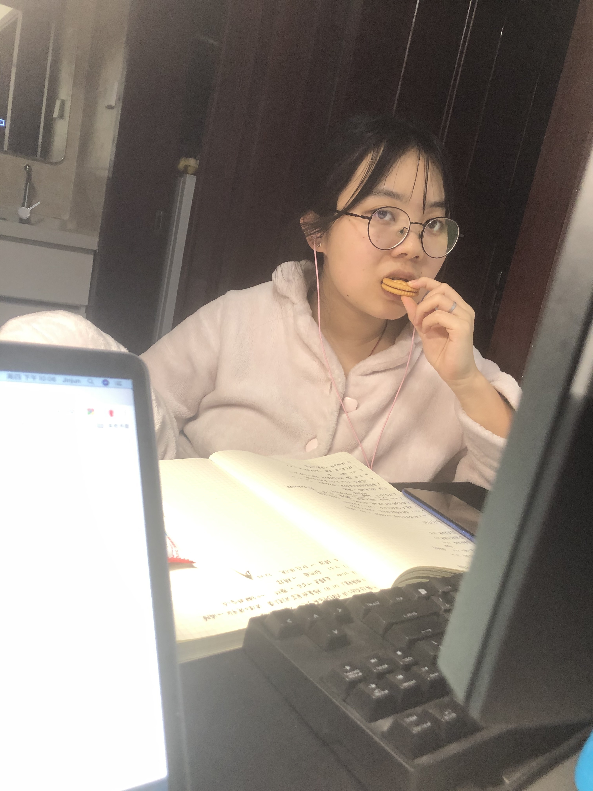

### 个人技术学习笔记
为了方便索引和同步，逐步合并更新到这里来，后续会逐步完成填充，目前只有大纲

* [序](README.md)
* 数据结构和算法
    * [数据结构](datastructure_and_algorithm/data_sturcture.md)
    * [算法](datastructure_and_algorithm/algorithm.md)
    * 
* UML和设计模式

    * [UML笔记](UML_and_Design_Pattern/UML.md)

* CPP

* 操作系统

* python和数据分析

* AI算法

* Tensorflow

我每天学习的时候，都能看见这样一只猪，让我学习的很开心。

: