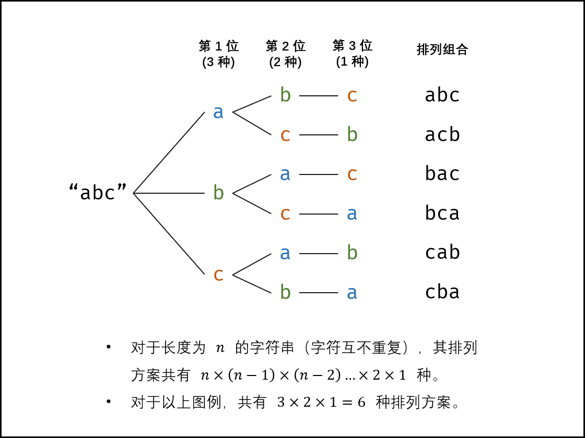

### 剑指Offer

[TOC]


#### 反转链表
输入一个链表，反转链表后，输出新链表的表头
```cpp
/*
struct ListNode {
	int val;
	struct ListNode *next;
	ListNode(int x) :
			val(x), next(NULL) {
	}
};*/
class Solution {
public:
    ListNode* ReverseList(ListNode* pHead) {
        ListNode *pre, *next,*cur;
        pre = NULL;
        cur = pHead;
        next = NULL;
        while (cur != NULL) {
            next = cur->next;
            cur->next = pre;
            pre = cur;
            cur = next;
        }
        return pre;
    }
};
```


#### 树的子结构

输入两棵二叉树A，B，判断B是不是A的子结构。（ps：我们约定空树不是任意一个树的子结构）

```cpp
/*
struct TreeNode {
	int val;
	struct TreeNode *left;
	struct TreeNode *right;
	TreeNode(int x) :
			val(x), left(NULL), right(NULL) {
	}
};*/
class Solution {
public:
    bool HasSubtree(TreeNode* pRoot1, TreeNode* pRoot2)
    {
        bool res = false;
        if(pRoot1 != NULL && pRoot2 != NULL) {
            if(pRoot1->val == pRoot2->val) {
                res = isSubtree(pRoot1,pRoot2);
            }
            if(!res) {
                res = HasSubtree(pRoot1->left, pRoot2);
            }
            if(!res) {
                res = HasSubtree(pRoot1->right, pRoot2);
            }
        }
        return res;
    }
    bool isSubtree(TreeNode *p1, TreeNode* p2) {
        if (p2 == NULL) {
            return true;
        }
        if (p1 == NULL) {
            return false;
        }
        if(p1->val != p2->val){
            return false;
        } 
        return isSubtree(p1->left, p2->left) && isSubtree(p1->right, p2->right);
    }
};
```

#### 二叉树的镜像
操作给定的二叉树，将其变换为源二叉树的镜像。
输入描述:
二叉树的镜像定义：源二叉树 
    	    8
    	   /  \
    	  6   10
    	 / \  / \
    	5  7 9 11
    	镜像二叉树
    	    8
    	   /  \
    	  10   6
    	 / \  / \
    	11 9 7  5
```cpp
/*
struct TreeNode {
	int val;
	struct TreeNode *left;
	struct TreeNode *right;
	TreeNode(int x) :
			val(x), left(NULL), right(NULL) {
	}
};*/
class Solution {
public:
    void Mirror(TreeNode *pRoot) {
        if (pRoot == NULL) {
            return;
        }
        TreeNode *pTemp = pRoot->right;
        pRoot->right = pRoot->left;
        pRoot->left = pTemp;
        if (pRoot->left) {
            Mirror(pRoot->left);
        }
        if (pRoot->right) {
            Mirror(pRoot->right);
        }
        return;
    }
};
```

#### 顺时针打印矩阵
输入一个矩阵，按照从外向里以顺时针的顺序依次打印出每一个数字，例如，如果输入如下4 X 4矩阵： 1 2 3 4 5 6 7 8 9 10 11 12 13 14 15 16 则依次打印出数字1,2,3,4,8,12,16,15,14,13,9,5,6,7,11,10.

```cpp
class Solution {
public:
    vector<int> printMatrix(vector<vector<int> > matrix) {
        vector<vector<int> > copy(matrix);
        vector<int> res;
        while(copy.size() != 0 && copy[0].size() !=0) {
            for (int i = 0; i < copy[0].size(); ++i) {
                res.push_back(copy[0][i]);
            }
            copy.erase(copy.cbegin());
            if(copy.size() != 0 && copy[0].size() != 0)
                copy = rotate(copy);
            }
        return res;
    }
    vector<vector<int>> rotate(vector<vector<int> > matrix) {
        vector <vector<int> > res(matrix[0].size(), vector<int> (matrix.size()));
        int m = 0;
        int n = 0;
        for (int i = matrix[0].size() - 1; i >= 0; --i) {
            for (int j = 0; j < matrix.size(); ++j) {
                res[m][n++] = matrix[j][i];
            }
            m++;
            n = 0;
        }
        return res;
    }
};
```

#### 包含min函数的栈
定义栈的数据结构，请在该类型中实现一个能够得到栈中所含最小元素的min函数（时间复杂度应为O（1））。
注意：保证测试中不会当栈为空的时候，对栈调用pop()或者min()或者top()方法。
```cpp
class Solution {
public:
    void push(int value) {
        s.push(value);
        if(s_min.empty() || value < s_min.top())
            s_min.push(value);
    }
    void pop() {
        if (s_min.top() == s.top()) 
            s_min.pop(); 
        s.pop();
    }
    int top() {
        return s.top();
    }
    int min() {
        return s_min.top();
        
    }
private:
    stack <int> s;
    stack <int> s_min;

};
```

#### 栈的压入、弹出序列
输入两个整数序列，第一个序列表示栈的压入顺序，请判断第二个序列是否可能为该栈的弹出顺序。假设压入栈的所有数字均不相等。例如序列1,2,3,4,5是某栈的压入顺序，序列4,5,3,2,1是该压栈序列对应的一个弹出序列，但4,3,5,1,2就不可能是该压栈序列的弹出序列。（注意：这两个序列的长度是相等的）
```cpp
class Solution {
public:
    bool IsPopOrder(vector<int> pushV,vector<int> popV) {
        //压入一个，尝试弹出一次，如果最后能够全部弹出，就说明是弹出序列
        stack<int> s;
        for (int i = 0, j = 0; i < pushV.size(); ++i) {
            s.push(pushV[i]);
            while( j < popV.size() && popV[j] == s.top()) {     //j < popV.size()  为什么？？？===》
                s.pop();
                j++;
            }
        }
        return s.empty();
    }
};
```

#### 从上往下打印出二叉树的每个节点，同层节点从左至右打印。
```cpp
/*
struct TreeNode {
	int val;
	struct TreeNode *left;
	struct TreeNode *right;
	TreeNode(int x) :
			val(x), left(NULL), right(NULL) {
	}
};*/
class Solution {
public:
    vector<int> PrintFromTopToBottom(TreeNode* root) {
        queue<TreeNode*> line;
        vector<int> res;
        if (root == NULL) {
            return res;
        }
        TreeNode *p;
        line.push(root);
        while(!line.empty()) {
            p = line.front();
            res.push_back(p->val);
            if (p->left != NULL) {
                line.push(p->left);
            }
            if (p->right != NULL) {
                line.push(p->right);
            }
            line.pop();
        }
        return res;
            
    }
};
```

####  二叉搜索树的后序遍历序列

输入一个整数数组，判断该数组是不是某二叉搜索树的后序遍历的结果。如果是则输出Yes,否则输出No。假设输入的数组的任意两个数字都互不相同。

```cpp
class Solution {
public:
    bool IsBST(vector<int> &a, int start, int end) {
        // 结构：  左子树+右子树+根节点
        if (start >= end) {                //该条件说明数组遍历结束，符合有序
            return true;
        }
        int pivot;
        for(pivot = end; a[--pivot] > a[end];);  // 寻找切分点，从后往前寻找
        for(int i = pivot; i >= 0; i--) {        // 检查前半段数字是否都是符合小于根节点
            if(a[i] > a[end]) return false;
        }
        return IsBST(a, start, pivot) && IsBST(a, pivot+1, end-1);    //分治递归检查
        
    }
    bool VerifySquenceOfBST(vector<int> sequence) {
        if(sequence.size()==0) return false;
        return IsBST(sequence, 0, sequence.size()-1);
    }
    
};
```


#### 二叉树中和为某一值的路径

输入一颗二叉树的根节点和一个整数，打印出二叉树中结点值的和为输入整数的所有路径。路径定义为从树的根结点开始往下一直到叶结点所经过的结点形成一条路径。(注意: 在返回值的list中，数组长度大的数组靠前)
* 解决思路： 
	1.搜索路径，应该想到是一个dfs问题，递归处理
	2.边界条件的考虑：路径符合题意的话需要满足
		* 结束节点是一个叶子节点，实现为代码就是node->left == NULL && node->right == NULL
		* 加上结束节点的值恰好等于期望的sum值，这里需要从根节点递归到叶子节点，每递归一个节点，sum值减去节点的val，直到减去最后的叶子节点恰好等于0，条件等价于 sum == node->val

* 递归的设计：
	1. 输入判空
	2. 先把节点记录到path数组
	3. 判断是否到达叶子节点，如果到达叶子节点，是否满足和值条件
	4. 不是叶子节点就继续递归，直到递归到叶子节点为止。
	5. 如果没有继续递归，也没有满足和值条件，那么从path数组中弹出这个节点


```cpp
/*
struct TreeNode {
	int val;
	struct TreeNode *left;
	struct TreeNode *right;
	TreeNode(int x) :
			val(x), left(NULL), right(NULL) {
	}
};*/
class Solution {
public:
    vector<vector<int>> res;
    vector<int> path;
    void dfsFind(TreeNode* node, int sum) {
        if (node == NULL) {
            return;
        }
        path.push_back(node->val);		//path数组记录节点
      	// 判断是否为叶子节点，且满足和值条件
        if (node->left == NULL && node->right == NULL && sum == node->val) {
            res.push_back(path);
        } else {	// 不是叶子节点，继续递归
            if (node->left) {
                dfsFind(node->left, sum - node->val);
            }
            if (node->right) {
                dfsFind(node->right, sum - node->val);
            }
        }
        path.pop_back(); 	//不能被递归，也不满足和值条件，就弹出该节点
    }
    
    vector<vector<int> > FindPath(TreeNode* root,int expectNumber) {
        dfsFind(root, expectNumber);
        return res;
    }
};

```


#### 复杂链表的复制

输入一个复杂链表（每个节点中有节点值，以及两个指针，一个指向下一个节点，另一个特殊指针指向任意一个节点），返回结果为复制后复杂链表的head。（注意，输出结果中请不要返回参数中的节点引用，否则判题程序会直接返回空）

```cpp
/*
struct RandomListNode {
    int label;
    struct RandomListNode *next, *random;
    RandomListNode(int x) :
            label(x), next(NULL), random(NULL) {
    }
};
*/
/*
首先想到的办法是直接遍历一遍，把指针关系记录下来，复制的时候再把指针关系恢复上去；
但是指针的指向关系是原始链表的指向关系，复制到新链表的话还是指向原始链表；
解决方法1：
1.遍历第一遍，在原始链表的每个节点后面插入一个新的节点
2.遍历第二遍，用random指针来遍历，将每个节点的后继节点的random指向本节点random节点的next；
    实际上是通过跟踪旧链表random的指向来更新新链表的random指针
3.拆分链表，其实就是依次更新原链表和新链表的next指针，然后再迭代遍历链表；注意边界条件，不要访问到空指针
*/
class Solution {
public:
    RandomListNode* Clone(RandomListNode* pHead)
    {
        if (!pHead) return NULL;
        RandomListNode *cur = pHead;
        //1.第一次更新，复制节点
        while (cur) {
            RandomListNode *node = new RandomListNode(cur->label);
            node->next = cur->next;
            cur->next = node;
            cur = node->next;
        }
        //2.第二次遍历，更新random指针
        cur = pHead;
        while (cur) {
            RandomListNode *node = cur->next;
            if(cur->random) {
                node->random = cur->random->next;
            }
            cur = node->next;
        }
        //3. 第三次遍历，拆分链表
        //拆分步骤需要思考：其实就是依次更新原链表和新链表的next指针，然后再迭代遍历链表
        RandomListNode *newhead = pHead->next;
        RandomListNode *newcur =  newhead;
        cur = pHead;
        while (cur) {
            cur->next = cur->next->next;
            if(newcur->next)    //最后一次循环的边界条件，避免访问空指针
                newcur->next = newcur->next->next;
            cur = cur->next;
            newcur = newcur->next;
        }
        return newhead;
    }
};
```

#### 二叉搜索树与双向链表

输入一棵二叉搜索树，将该二叉搜索树转换成一个排序的双向链表。要求不能创建任何新的结点，只能调整树中结点指针的指向。

解决思路： 最后返回一个排序的双向链表，因此：

1. 先对二叉树进行中序遍历，把中序遍历的结果存储到一个数组中，
2. 依次从数组中取出二叉树的节点串成双向链表

```cpp
/*
struct TreeNode {
	int val;
	struct TreeNode *left;
	struct TreeNode *right;
	TreeNode(int x) :
			val(x), left(NULL), right(NULL) {
	}
};*/
class Solution {
public:
    TreeNode* Convert(TreeNode* pRootOfTree)
    {
        if(pRootOfTree == NULL) {
            return NULL;
        }
        vector<TreeNode *> list;
        Convert(pRootOfTree, list);		//中序遍历，并把节点存储到数组中
        return ProcessList(list);			//把数组中的节点处理成双向链表
    }
    
    void Convert(TreeNode* p, vector<TreeNode *> &list) {
        if(p != NULL) {
            Convert(p->left,list);
            list.push_back(p);
            Convert(p->right,list);
        }
        
    }
    TreeNode* ProcessList(vector<TreeNode *> list) {
        TreeNode * head = list[0];
        TreeNode * cur = head;
        for(int i=1;i<list.size();++i) {
            TreeNode * temp = list[i];		
            temp->left = cur;				//第二个节点的前驱指向第一个节点
            cur->right = temp;			//第一个节点的后继指向第二个节点
            cur = temp;
        }
        return head;
    }
};
```

#### 38.字符串的排列 

* DFS+回溯+剪枝

输入一个字符串,按字典序打印出该字符串中字符的所有排列。例如输入字符串abc,则打印出由字符a,b,c所能排列出来的所有字符串abc,acb,bac,bca,cab和cba。


思路：从头开始，用一个元素依次和字符串的每个元素交换，比如 abcd，a分别和b,c,d交换，这是第一层递归；固定a，用b依次与c,d交换，这是第二次递归；固定ab，用c和d交换，这是第三次递归；轮到d时，d的下标就是长度n-1，此时应当把字符串存起来；

本题是一个DFS算法题，每层递归处理一个字符，字符串的长度就是递归的层数，可以画一棵多叉树来分析。递归的遍历情况可以画一个树来表示，leetcode的题解有图，可以看看



* DFS的剪枝可以用一个set辅助来做，如abbcd，用下标为1的b依次与bcd交换时，和自己相同的b就不做交换


题解：

https://leetcode-cn.com/problems/zi-fu-chuan-de-pai-lie-lcof/solution/mian-shi-ti-38-zi-fu-chuan-de-pai-lie-hui-su-fa-by/

```cpp
//递归算法
class Solution {
public:
    vector<string> permutation(string s) {
        vector<string> res;
        helper(res, s, 0);
        sort(res.begin(), res.end());
        return res;
    }
    void helper(vector<string> &res, string &str, int begin) {
        if(begin == str.length()) {     //begin位置
            res.push_back(str);
            return;
        }
        set<int> help_set;	//用于辅助做剪枝
        for(int i = begin; i < str.length(); ++i) {
            if (help_set.count(str[i]) == 0) {	//只对set中不存在的元素进行交换
                help_set.insert(str[i]);		//把交换过的都添加到set中
                swap(str[i], str[begin]);   //把begin位置的元素和i位置的元素交换
                helper(res, str, begin+1);  
                swap(str[i], str[begin]);   //还原
            }      
        }
    }
};
```


#### 39. 数组中出现次数超过一半的数字
数组中有一个数字出现的次数超过数组长度的一半，请找出这个数字。 

你可以假设数组是非空的，并且给定的数组总是存在多数元素。 

示例 1:

		输入: [1, 2, 3, 2, 2, 2, 5, 4, 2]
		输出: 2


**解法1**：  哈希法，找到出现数组长度二分之一的数字就返回

```cpp
class Solution {
public:
    int majorityElement(vector<int>& nums) {
        unordered_map<int, int> hash;
        int res = 0; 
        int len = nums.size();
        for(int i = 0; i< nums.size();++i) {
            hash[nums[i]]++;
            if(hash[nums[i]] > len/2) {
                res = nums[i];
                return res;
            }  
        }
        return res;
    }
};
```

**解法2**：摩尔投票法：核心思想就是投票，出现相同的加票，出现不同的减票

我的理解是：逐个比较，遇到和自己相同的票数+1，遇到和自己不同的票数-1；票数减到0就说明干掉这个数字了，让新的数字上任：

```cpp
class Solution {
public:
    int majorityElement(vector<int>& nums) {
        int vote = 0, major = 0;
        for (int i = 0 ; i<nums.size(); ++i) {
	          //票数为0: 情况1:初始化 情况2:前面投的票都不相同 (有多票的情况下不会进这个逻辑)
            if (vote == 0) { 
                major = nums[i];      
                vote = 1;
            } else {
                major == nums[i] ? ++vote:--vote;     //相同票数+1， 不同票数-1
            }
        }
        return major;
        
    }
};
```


#### [40. 最小的k个数](https://leetcode-cn.com/problems/zui-xiao-de-kge-shu-lcof/)

输入整数数组 arr ，找出其中最小的 k 个数。例如，输入4、5、1、6、2、7、3、8这8个数字，则最小的4个数字是1、2、3、4。

示例 1：

		输入：arr = [3,2,1], k = 2
		输出：[1,2] 或者 [2,1]
示例 2：

		输入：arr = [0,1,2,1], k = 1
		输出：[0]

**解法1：** 快排 O(nlogn)

```cpp
class Solution {
public:
    vector<int> getLeastNumbers(vector<int>& arr, int k) {
        vector<int> res;
        if (arr.size() == 0 || k == 0) {
            return res;
        }
        quick_sort(arr, 0, arr.size()-1);
        for(int i = 0; i < k;++i) {
            res.push_back(arr[i]);
        }
        return res;
    }
    
    void quick_sort(vector<int>& arr, int lo, int hi) {
        if (lo >= hi) {
            return;
        }
        int j = partition(arr, lo, hi);
        quick_sort(arr, lo, j-1);
        quick_sort(arr, j+1, hi);

    }

    int partition(vector<int> &arr, int lo, int hi) {
        int pivot = arr[lo];
        int i = lo, j = hi+1;
        while(true) {
            while(++i <= hi && arr[i]< pivot);
            while(--j >= lo && arr[j] > pivot);
            if(i >= j) break;
            swap(arr[i],arr[j]);
        }
        swap(arr[lo],arr[j]);
        return j;
    }
};
```

**解法2：**堆 O(nlogk)  数组长度n*堆的删除插入logk

思路：初始化一个大小为k的优先队列（大顶堆），然后遍历数组，比堆顶小的数就入堆，数组遍历结束后，堆里的k个数字就是最小的k个数字

```cpp
class Solution {
public:
    vector<int> getLeastNumbers(vector<int>& arr, int k) {
        vector<int> res;
        if(arr.size() == 0 || k ==0) {
            return res;
        }
        priority_queue<int> que;
        for(int i = 0; i < k;++i) {
            que.push(arr[i]);
        }
        for(int i = k; i < arr.size();++i) {
            if(que.top()>arr[i]) {
                que.pop();
                que.push(arr[i]);
            }
        }
        for(int i = 0; i<k; ++i) {
            res.push_back(que.top());
            que.pop();
        }
        return res;
    }
};
```


#### 41.数据流中的中位数 TODO 


#### 42. 连续子数组的最大和
输入一个整型数组，数组里有正数也有负数。数组中的一个或连续多个整数组成一个子数组。求所有子数组的和的最大值。

要求时间复杂度为O(n)。


示例1:
```
输入: nums = [-2,1,-3,4,-1,2,1,-5,4]
输出: 6
解释: 连续子数组 [4,-1,2,1] 的和最大，为 6。
```

来源：力扣（LeetCode）
链接：https://leetcode-cn.com/problems/lian-xu-zi-shu-zu-de-zui-da-he-lcof
著作权归领扣网络所有。商业转载请联系官方授权，非商业转载请注明出处。

**解法：**动态规划解决这道题目
回忆一下动态规划三要素：

* 最优子结构（最优解就是一个子问题）
* 重复子问题（后续子问题的求解，需要重复求解前面子问题的解）
* 无后效性（求解下一个状态只依赖前一个状态），

对应到该题中：

* 最优子结构就是找到累加起来的最大值；

* 重复子问题就是动态规划表的每一次求值，可能会依赖前一个表项的值

* 无后效型可以理解为动态规划表中只关注第i个数字之前的表项，而和第i个数字之后的没关系

可以看看注释里的状态转移方程表示了递推关系，从正贡献和负贡献的角度去思考：

```cpp
// 动态规划题
// 每个阶段/状态：数组中从第i个数往前累加取得最大值的状态，只需记录最大值，无需记录其实下标
// 子问题：第i个数对应状态的最大值，需要累加第i-1个数的最大值
// 状态转移方程:    dp[i-1]>0时 dp[i] = nums[i]+dp[i-1]   前面求和是正贡献，加起来
//                dp[i-1]<0时 dp[i] = nums[i]           前面求和是负贡献，不如直接取nums[i]
class Solution {
public:
    int maxSubArray(vector<int>& nums) {
        vector<int> dp(nums.size(),0);
        int max = nums[0];
        dp[0] = nums[0];
        for(int i = 1; i < nums.size(); ++i) {
            if(dp[i-1] > 0) {
                dp[i] = nums[i]+dp[i-1];
            } else if(dp[i-1] <= 0) {
                dp[i] = nums[i];
            }
            if (dp[i] > max) {
                max = dp[i];
            }
        }
        return max; 
    }
};
```


#### 面试题43. 1～n整数中1出现的次数
输入一个整数 n ，求1～n这n个整数的十进制表示中1出现的次数。

例如，输入12，1～12这些整数中包含1 的数字有1、10、11和12，1一共出现了5次。

示例 1：
输入：n = 12
输出：5
示例 2：

输入：n = 13
输出：6


限制：

1 <= n < 2^31
注意：本题与主站 233 题相同：https://leetcode-cn.com/problems/number-of-digit-one/

**解法：** 首先排除暴力搜索，已验证会超时；这种题看起来像是DP可以做的题，但实际上并太好用DP去做, 因为不满足最优子结构条件, 而是计数为主; 以后做题遇到计数类的题目还是不要用DP了；
最后琢磨一个小时做不出来还是看了题解，看题解都费很大劲，思路各异；我选择推荐题解来理解一下，也算是做这种题目的一种思路吧！


从个位到高位逐位分析：例如 23456，分解成高位high=234  当前位cur=5  最低位low=6  位因子digit=1 (从个位往高位分析)

|dight  | high | cur  | low  |
| :--:  | :--: | :--: | :--: |
|1			|	2345 |	6		|	 0   |
|10     | 234  |  5   |  6   |
|100    |  23  |  4   |  56  |
|1000   |  2   |  3   | 456  |

```
分析high位的影响：
		无论如何都会有234\*digit =234个1
分析cur位的影响：
		cur=0时，无影响，不加1；
		cur=1时，还要考虑low位的影响，有low+1个1（从0数到low）；
		cur>1时，考虑10，11，12，...，19 肯定要直接算上10个1；
分析low位影响：
		分析cur=1时已经覆盖该情况；

所以有三个逻辑处理分支：
1. cur==0: +high*digit
2. cur==1: +high*dight+low*1
3. cur>1： +high*dight+digit

如何迭代：
低位依赖高位！所以先处理低位再处理高位：
low = low + cur*dight;
cur = high%10
high = high/10

边界条件：
high != 0 || cur != 0  即  high == 0 && cur == 0
为什么high和cur都为0才是边界条件
只有high和cur同时为0时，才会使low覆盖到最高位

```

```cpp
class Solution {
public:
    int countDigitOne(int n) {
        long digit = 1, res = 0;
        long high = n/10, cur = n%10, low = 0;
        // 分析每位出现1的次数，依次从个位分析到高位
        // 一个数字分成三部分：高位high， 当前位cur，低位low， 位因子digit=10的x次方
        while (high != 0 || cur != 0) {  // digit从个位开始
            if (cur == 0) {
                res += high*digit;
            } else if (cur == 1) {
                res += high*digit + low + 1;    // 为什么加low? 11,12,13,14 ==> +low=4   为什么加1? 10==> +1
            } else {
                res += high * digit + digit;      // 为什么加digit？ 10,11,12,...,19,20 ==> 只有10个
            }
            low += cur * digit;
            cur = high % 10;
            high /= 10;
            digit *= 10;
        }
        return res;
    }
};
```


### 有缘再续，做到现在感觉做了后面的忘了前面的，接下来我想分类刷题4个月看看效果如何